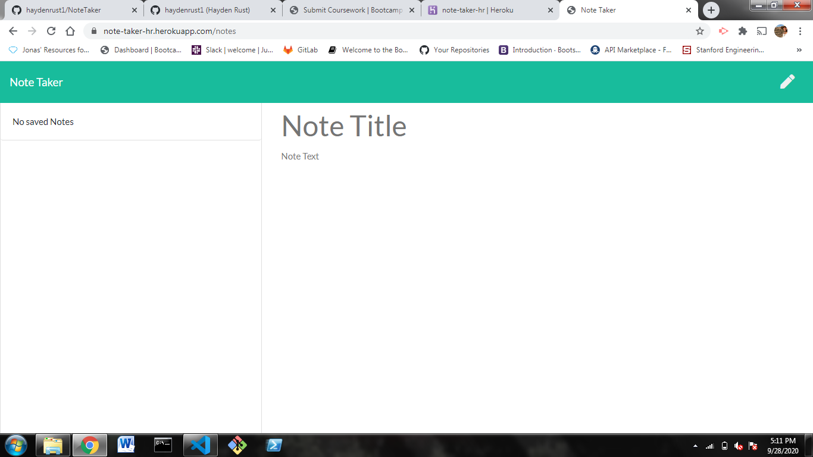

  # Note Taker

  

  ## Description
  * This application was created for storing information that a user may want to save for later.  From personal to business related, this application is meant for anyone!

  ## Table of Contents
  * [Installation](#installation)
  * [Usage](#usage)
  * [License](#license)
  * [Contributing](#contributing)
  * [Tests](#tests)
  
  ## Installation

  ## Usage
  * The Note Taker application allows the user to save important or personal information for later use.
 

  ## License
  * This project is licensed under: MIT

  ## Contributing
  * This application follows the [Contributor Covenant](https://www.contributor-covenant.org/).  Follow the link in order to find out more.
  
  ## Questions
  Please contact me with any questions you may have using the links below!
  * [GitHub Profile](https://github.com/haydenrust1)
  * <haydenrust1@gmail.com>
  